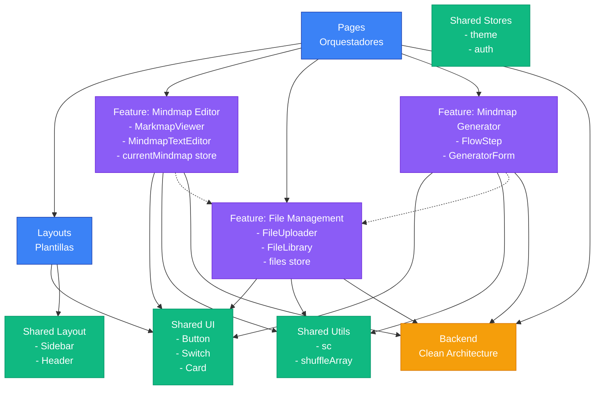
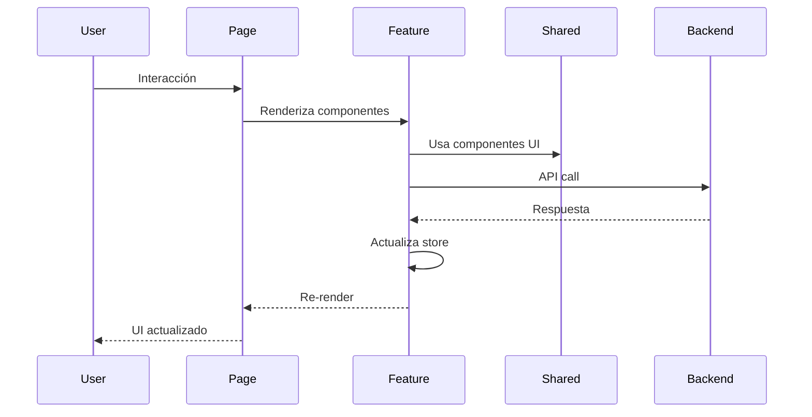
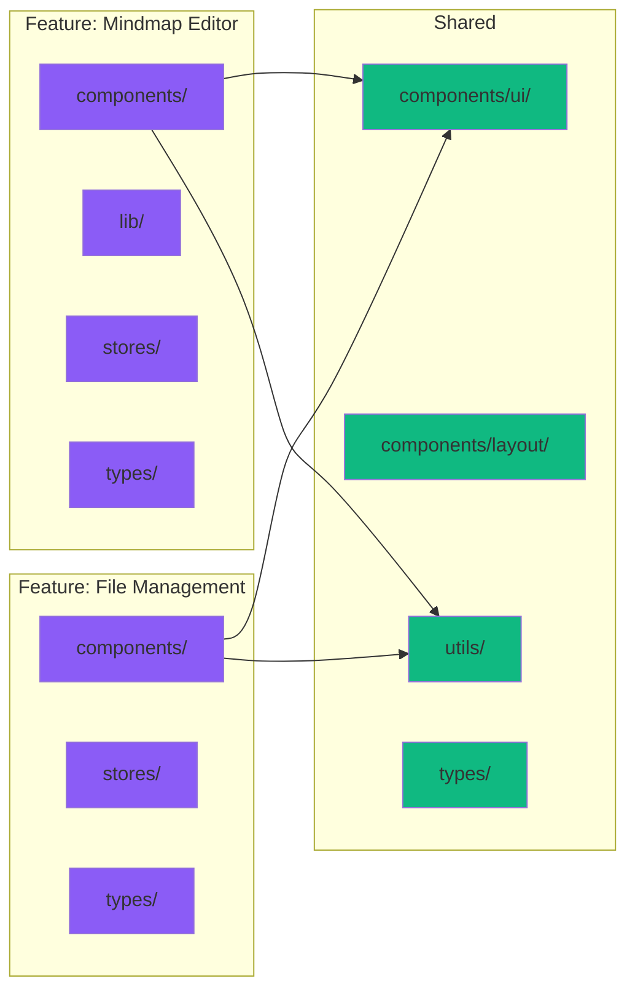
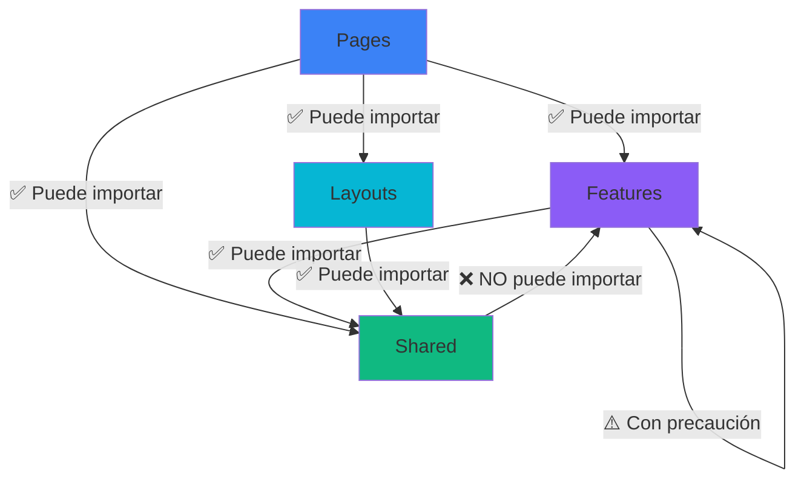
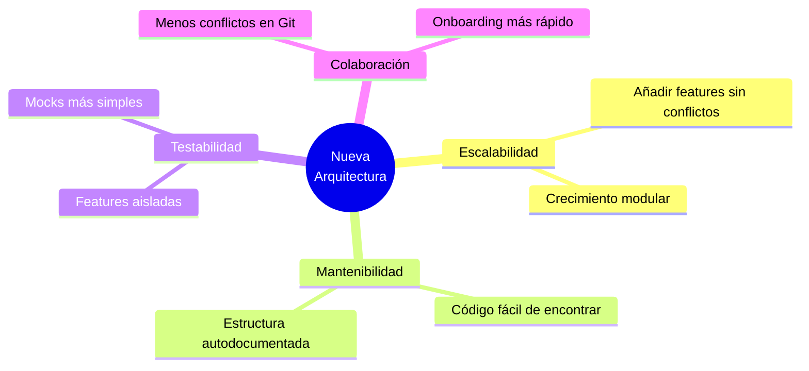
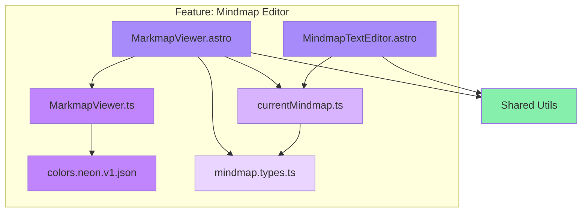

# Diagrama de Arquitectura Frontend

## Estructura de Dependencias



## Flujo de Información



## Organización de Features



## Reglas de Importación



## Comparación: Antes vs Después

### Antes (Estructura Plana)
```
src/
├── components/      ← TODO mezclado
├── stores/          ← Estado global no organizado
├── utils/           ← Utilidades sin categorizar
└── pages/
```

### Después (Arquitectura por Capas)
```
src/
├── features/        ← Agrupado por capacidad
│   ├── mindmap-editor/
│   ├── file-management/
│   └── mindmap-generator/
├── shared/          ← Solo código reutilizable
│   ├── components/
│   ├── stores/
│   └── utils/
└── pages/           ← Orquestadores ligeros
```

## Beneficios Visuales



## Ejemplo de Feature Completo

