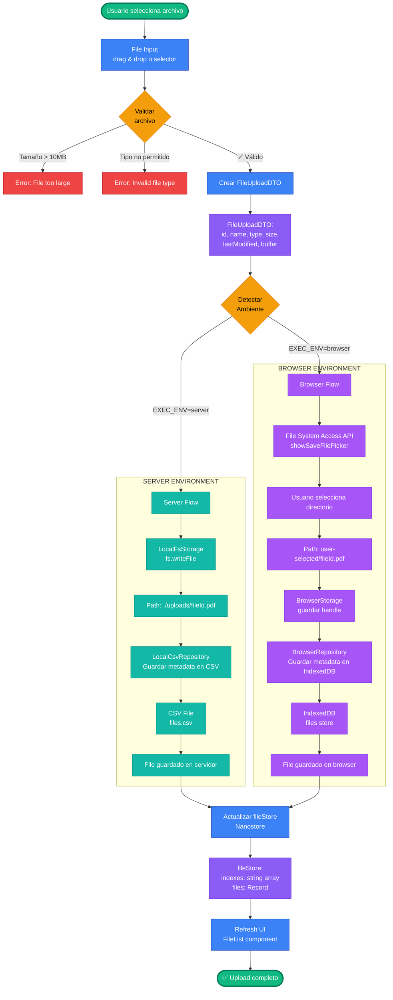
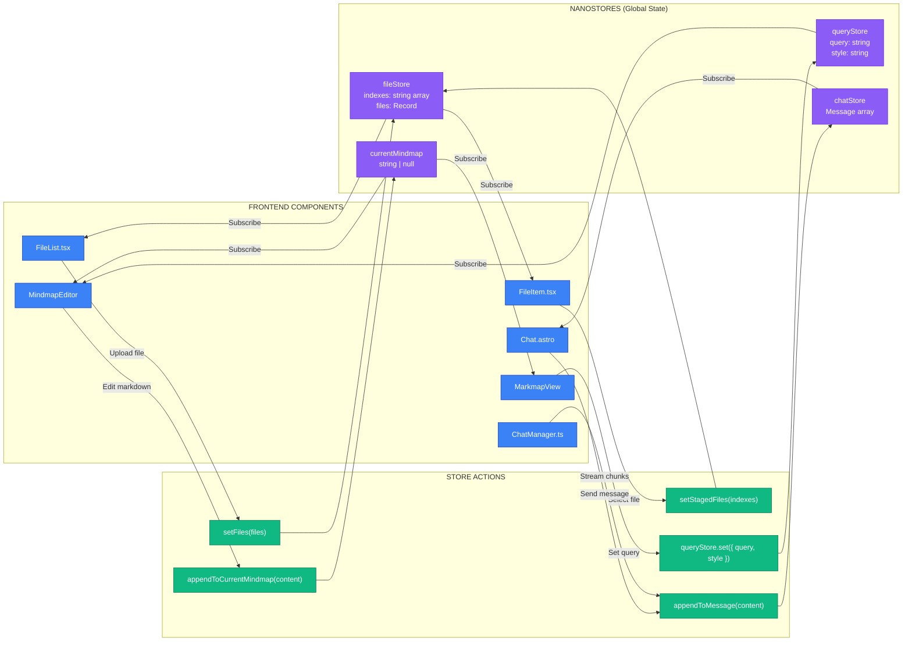
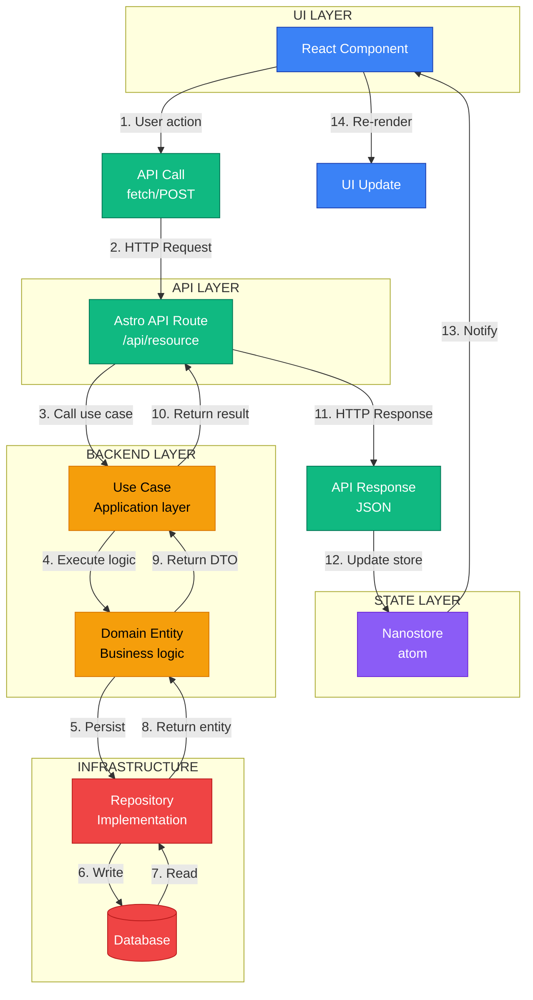

# Diagramas de Flujo de Datos - MindMapAI

## 📊 Flujo de Datos Principal: Pipeline de Conocimiento Completo

```mermaid
graph TB
    Start([Usuario carga PDF]) --> Upload[Upload File]

    Upload --> ValidateFile{Validar<br/>archivo}
    ValidateFile -->|❌ Inválido| Error1[Error: Formato no soportado]
    ValidateFile -->|✅ Válido| SaveFile[Guardar archivo]

    SaveFile --> Storage{Seleccionar<br/>Storage}
    Storage -->|Server| LocalFS[LocalFsStorage<br/>Filesystem]
    Storage -->|Browser| BrowserFS[BrowserStorage<br/>File System Access API]

    LocalFS --> SaveMeta1[Guardar metadata<br/>LocalCsvRepository]
    BrowserFS --> SaveMeta2[Guardar metadata<br/>BrowserRepository IndexedDB]

    SaveMeta1 --> FileStored[(File Stored)]
    SaveMeta2 --> FileStored

    FileStored --> ExtractText[Extraer Texto<br/>PDF Extractor]

    ExtractText --> ParsePDF[pdfjs-dist<br/>Parse PDF]
    ParsePDF --> RawText[Texto Crudo]

    RawText --> CleanText[Text Cleaner<br/>Eliminar espacios, caracteres especiales]
    CleanText --> CleanedText[Texto Limpio]

    CleanedText --> SaveText[Guardar texto<br/>TextRepository]
    SaveText --> TextStored[(Text Stored)]

    TextStored --> Chunking[Chunking<br/>Particionar texto]

    Chunking --> SelectStrategy{Seleccionar<br/>Estrategia}

    SelectStrategy -->|Fixed-size| FS[FixedSizeChunker<br/>1000 chars, 200 overlap]
    SelectStrategy -->|Sentence| SC[SentenceChunker<br/>Por oraciones]
    SelectStrategy -->|Paragraph| PC[ParagraphChunker<br/>Por párrafos]
    SelectStrategy -->|Recursive| RC[RecursiveChunker<br/>Recursivo con separadores]
    SelectStrategy -->|Semantic| SemC[SemanticChunker<br/>Requiere embeddings]

    FS --> ChunksArray[Array de Chunks]
    SC --> ChunksArray
    PC --> ChunksArray
    RC --> ChunksArray
    SemC --> ChunksArray

    ChunksArray --> SaveChunks[Guardar chunks<br/>ChunkRepository]
    SaveChunks --> ChunksStored[(Chunks Stored)]

    ChunksStored --> Embedding[Generar Embeddings<br/>EmbeddingProvider]

    Embedding --> SelectProvider{Seleccionar<br/>Provider}

    SelectProvider -->|Server| Cohere[Cohere Provider<br/>embed-english-v3.0<br/>1024 dims]
    SelectProvider -->|Server Alt| HF[HuggingFace Provider<br/>sentence-transformers<br/>384 dims]
    SelectProvider -->|Browser| Browser[Browser Provider<br/>@xenova/transformers<br/>384 dims]

    Cohere --> EmbedAPI1[Cohere API]
    HF --> EmbedAPI2[HuggingFace API]
    Browser --> LocalModel[Local Model<br/>all-MiniLM-L6-v2]

    EmbedAPI1 --> Vectors[Vectores de Embeddings]
    EmbedAPI2 --> Vectors
    LocalModel --> Vectors

    Vectors --> VectorDocs[VectorDocuments<br/>id, chunkId, vector, metadata]

    VectorDocs --> SaveVectors{Seleccionar<br/>VectorRepository}

    SaveVectors -->|Server| LevelDB[LocalLevelRepository<br/>LevelDB]
    SaveVectors -->|Browser| IndexedDB[BrowserRepository<br/>IndexedDB]

    LevelDB --> VectorsStored[(Vectors Indexed)]
    IndexedDB --> VectorsStored

    VectorsStored --> AssetCreated[Knowledge Asset Created]
    AssetCreated --> Complete([✅ Pipeline Completado])

    %% Styling
    classDef startEnd fill:#10b981,stroke:#047857,color:#fff,stroke-width:3px
    classDef process fill:#3b82f6,stroke:#1e40af,color:#fff
    classDef decision fill:#f59e0b,stroke:#d97706,color:#000
    classDef storage fill:#8b5cf6,stroke:#6d28d9,color:#fff
    classDef error fill:#ef4444,stroke:#b91c1c,color:#fff
    classDef api fill:#ec4899,stroke:#be185d,color:#fff

    class Start,Complete startEnd
    class Upload,SaveFile,ExtractText,ParsePDF,CleanText,SaveText,Chunking,SaveChunks,Embedding,AssetCreated process
    class ValidateFile,Storage,SelectStrategy,SelectProvider,SaveVectors decision
    class FileStored,TextStored,ChunksStored,VectorsStored storage
    class Error1 error
    class EmbedAPI1,EmbedAPI2,LocalModel api
```

---

## 🔍 Flujo de Búsqueda Semántica (Vector Search)

```mermaid
graph TB
    Start([Usuario hace Query]) --> QueryInput[Query: String]

    QueryInput --> Validate{Query<br/>válido?}
    Validate -->|❌| ErrorEmpty[Error: Query vacío]
    Validate -->|✅| EmbedQuery[Embed Query<br/>EmbeddingProvider]

    EmbedQuery --> SelectProvider{Provider}
    SelectProvider -->|Cohere| CohereEmbed[Cohere API<br/>embed-english-v3.0]
    SelectProvider -->|HuggingFace| HFEmbed[HuggingFace API<br/>sentence-transformers]
    SelectProvider -->|Browser| BrowserEmbed[Transformers.js<br/>all-MiniLM-L6-v2]

    CohereEmbed --> QueryVector[Query Vector<br/>float array 384-1024 dims]
    HFEmbed --> QueryVector
    BrowserEmbed --> QueryVector

    QueryVector --> LoadVectors[Cargar vectores<br/>VectorRepository]

    LoadVectors --> SelectRepo{Repository}
    SelectRepo -->|Server| LevelDB[LevelDB<br/>getAllDocuments]
    SelectRepo -->|Browser| IndexedDB[IndexedDB<br/>getAllDocuments]

    LevelDB --> AllVectors[Todos los vectores<br/>VectorDocument array]
    IndexedDB --> AllVectors

    AllVectors --> ComputeSimilarity[Computar Similitud<br/>Cosine Similarity]

    ComputeSimilarity --> ForEach{Para cada<br/>vector}

    ForEach --> DotProduct[dot = Σ queryᵢ × vecᵢ]
    DotProduct --> MagnitudeQ[magQ = √Σ queryᵢ²]
    MagnitudeQ --> MagnitudeV[magV = √Σ vecᵢ²]
    MagnitudeV --> Cosine[similarity = dot / magQ × magV]

    Cosine --> SimilarityScore[Score: 0-1]
    SimilarityScore --> AddToResults[Agregar a resultados]

    AddToResults --> MoreVectors{Más<br/>vectores?}
    MoreVectors -->|Sí| ForEach
    MoreVectors -->|No| SortResults[Ordenar por score<br/>descendente]

    SortResults --> TopK[Tomar Top K<br/>k = 5-10]

    TopK --> RetrieveChunks[Recuperar chunks<br/>por chunkId]

    RetrieveChunks --> ContextChunks[Context Chunks<br/>Array de chunks relevantes]

    ContextChunks --> BuildContext[Construir contexto<br/>concatenar chunks]

    BuildContext --> ContextString[Context String<br/>texto concatenado]

    ContextString --> Complete([✅ Contexto listo])

    %% Styling
    classDef startEnd fill:#10b981,stroke:#047857,color:#fff,stroke-width:3px
    classDef process fill:#3b82f6,stroke:#1e40af,color:#fff
    classDef decision fill:#f59e0b,stroke:#d97706,color:#000
    classDef storage fill:#8b5cf6,stroke:#6d28d9,color:#fff
    classDef error fill:#ef4444,stroke:#b91c1c,color:#fff
    classDef math fill:#06b6d4,stroke:#0891b2,color:#fff

    class Start,Complete startEnd
    class QueryInput,EmbedQuery,LoadVectors,ComputeSimilarity,SortResults,TopK,RetrieveChunks,BuildContext process
    class Validate,SelectProvider,SelectRepo,ForEach,MoreVectors decision
    class AllVectors,ContextChunks,ContextString storage
    class ErrorEmpty error
    class DotProduct,MagnitudeQ,MagnitudeV,Cosine,SimilarityScore math
```

---

## 💬 Flujo de Chat con RAG (Retrieval Augmented Generation)

```mermaid
graph TB
    Start([Usuario envía mensaje]) --> UserMessage[User Message<br/>texto del usuario]

    UserMessage --> AddToHistory[Agregar a historial<br/>chatStore]

    AddToHistory --> ChatHistory[(Chat History<br/>Message array)]

    ChatHistory --> EmbedQuery[Embed Query<br/>EmbeddingProvider]

    EmbedQuery --> QueryVector[Query Vector]

    QueryVector --> SearchVectors[Buscar vectores similares<br/>VectorRepository.search]

    SearchVectors --> TopKChunks[Top K chunks relevantes<br/>k = 5]

    TopKChunks --> BuildContext[Construir contexto<br/>concatenar chunks]

    BuildContext --> ContextStr[Context String]

    ContextStr --> BuildPrompt[Construir Prompt]

    BuildPrompt --> PromptTemplate["Prompt Template:<br/>---<br/>Context: contextStr<br/>---<br/>Chat History: messages<br/>---<br/>User: userMessage<br/>---<br/>Assistant:"]

    PromptTemplate --> AIRequest[Llamada a AI Provider<br/>streamCompletion]

    AIRequest --> SelectAI{AI Provider}

    SelectAI -->|Default| DeepSeek[DeepSeek-V3-0324<br/>AI SDK Provider]
    SelectAI -->|Alt| HuggingFace[HuggingFace Models<br/>HF Provider]

    DeepSeek --> StreamStart[Inicio de stream]
    HuggingFace --> StreamStart

    StreamStart --> CreateMessage[Crear mensaje assistant<br/>contenido vacío]

    CreateMessage --> AddToStore[Agregar a chatStore]

    AddToStore --> StreamLoop{Stream<br/>activo?}

    StreamLoop -->|Sí| ReadChunk[Leer chunk del stream]

    ReadChunk --> ParseChunk[Parsear chunk<br/>delta de texto]

    ParseChunk --> AppendContent[Append a mensaje<br/>appendToMessage]

    AppendContent --> UpdateUI[Actualizar UI<br/>render incremental]

    UpdateUI --> StreamLoop

    StreamLoop -->|No| Complete[Stream completo]

    Complete --> FinalMessage[Mensaje completo<br/>en chatStore]

    FinalMessage --> DisplayChat([✅ Mostrar en UI])

    %% Styling
    classDef startEnd fill:#10b981,stroke:#047857,color:#fff,stroke-width:3px
    classDef process fill:#3b82f6,stroke:#1e40af,color:#fff
    classDef decision fill:#f59e0b,stroke:#d97706,color:#000
    classDef storage fill:#8b5cf6,stroke:#6d28d9,color:#fff
    classDef ai fill:#ec4899,stroke:#be185d,color:#fff

    class Start,DisplayChat startEnd
    class UserMessage,AddToHistory,EmbedQuery,SearchVectors,BuildContext,BuildPrompt,CreateMessage,AddToStore,ReadChunk,ParseChunk,AppendContent,UpdateUI,Complete process
    class SelectAI,StreamLoop decision
    class ChatHistory,TopKChunks,ContextStr,PromptTemplate,FinalMessage storage
    class AIRequest,DeepSeek,HuggingFace,StreamStart ai
```

---

## 🧠 Flujo de Generación de Mindmap

```mermaid
graph TB
    Start([Usuario solicita mindmap]) --> SelectFile[Seleccionar archivo<br/>FileSelector]

    SelectFile --> FileSelected{Archivo<br/>seleccionado?}
    FileSelected -->|❌| ErrorNoFile[Error: No file selected]
    FileSelected -->|✅| InputQuery[Input Query<br/>tema del mindmap]

    InputQuery --> SelectStyle[Seleccionar estilo<br/>default, neon, educational, etc.]

    SelectStyle --> QueryData[QueryData<br/>query + style + fileId]

    QueryData --> LoadFile[Cargar archivo<br/>FilesApi.getFile]

    LoadFile --> FileBuffer[File Buffer<br/>PDF bytes]

    FileBuffer --> ExtractText[Extraer texto<br/>TextExtractor]

    ExtractText --> FullText[Full Text<br/>texto completo del PDF]

    FullText --> CheckQuery{Query<br/>específico?}

    CheckQuery -->|Sí| EmbedQuery[Embed query<br/>EmbeddingProvider]
    CheckQuery -->|No| UseFullText[Usar texto completo]

    EmbedQuery --> SearchRelevant[Buscar chunks relevantes<br/>Vector Search]
    SearchRelevant --> RelevantChunks[Chunks relevantes<br/>Top 10]
    RelevantChunks --> ContextText[Context Text]

    UseFullText --> ContextText

    ContextText --> BuildPrompt[Construir Prompt]

    BuildPrompt --> PromptTemplate["Prompt:<br/>---<br/>Create a mindmap in markdown format<br/>Topic: query<br/>Style: style<br/>Content: contextText<br/>---<br/>Format:<br/># Main Topic<br/>## Subtopic 1<br/>### Detail 1.1<br/>..."]

    PromptTemplate --> AIRequest[Llamada a AI<br/>streamCompletion]

    AIRequest --> DeepSeek[DeepSeek-V3<br/>AI SDK]

    DeepSeek --> StreamStart[Inicio stream markdown]

    StreamStart --> InitMindmap[Inicializar mindmap<br/>currentMindmap = '']

    InitMindmap --> StreamLoop{Stream<br/>activo?}

    StreamLoop -->|Sí| ReadChunk[Leer chunk markdown]

    ReadChunk --> AppendMindmap[Append a currentMindmap<br/>appendToCurrentMindmap]

    AppendMindmap --> UpdateEditor[Actualizar CodeMirror<br/>editor UI]

    UpdateEditor --> ParseMarkdown[Parsear markdown<br/>Markmap parser]

    ParseMarkdown --> TreeStructure[Tree Structure<br/>árbol jerárquico]

    TreeStructure --> RenderMarkmap[Render Markmap<br/>visualización interactiva]

    RenderMarkmap --> StreamLoop

    StreamLoop -->|No| FinalMindmap[Mindmap completo<br/>markdown final]

    FinalMindmap --> SaveOption{Usuario<br/>quiere guardar?}

    SaveOption -->|Sí| SaveMindmap[Guardar en repositorio<br/>MindmapRepository]
    SaveOption -->|No| DisplayOnly[Solo mostrar]

    SaveMindmap --> Stored[(Mindmap Stored)]
    DisplayOnly --> Complete([✅ Mindmap listo])
    Stored --> Complete

    %% Styling
    classDef startEnd fill:#10b981,stroke:#047857,color:#fff,stroke-width:3px
    classDef process fill:#3b82f6,stroke:#1e40af,color:#fff
    classDef decision fill:#f59e0b,stroke:#d97706,color:#000
    classDef storage fill:#8b5cf6,stroke:#6d28d9,color:#fff
    classDef error fill:#ef4444,stroke:#b91c1c,color:#fff
    classDef ai fill:#ec4899,stroke:#be185d,color:#fff
    classDef ui fill:#06b6d4,stroke:#0891b2,color:#fff

    class Start,Complete startEnd
    class SelectFile,InputQuery,SelectStyle,LoadFile,ExtractText,BuildPrompt,InitMindmap,ReadChunk,AppendMindmap,SaveMindmap process
    class FileSelected,CheckQuery,StreamLoop,SaveOption decision
    class QueryData,FileBuffer,FullText,ContextText,PromptTemplate,FinalMindmap,Stored storage
    class ErrorNoFile error
    class AIRequest,DeepSeek,StreamStart ai
    class UpdateEditor,ParseMarkdown,TreeStructure,RenderMarkmap,DisplayOnly ui
```

---

## 📤 Flujo de Upload y Storage (Multi-Environment)

---

## 🔄 Flujo de Sincronización de Estado (Nanostores)

---

## 📊 Flujo de Datos entre Capas

---

## 🎯 Resumen de Flujos Principales

| Flujo | Entrada | Salida | Componentes Clave |
|-------|---------|--------|-------------------|
| **Knowledge Pipeline** | PDF file | Knowledge Asset indexado | Files → Text Extraction → Chunking → Embeddings |
| **Vector Search** | Query string | Top K chunks relevantes | Embedding → Cosine Similarity → Ranking |
| **Chat RAG** | User message | AI response con contexto | Vector Search → Prompt Building → LLM Stream |
| **Mindmap Generation** | File + Query + Style | Markdown mindmap | Text Extraction → Context Building → LLM → Markmap |
| **File Upload** | File input | Stored file + metadata | Validation → Storage → Repository → Store |
| **State Sync** | Component action | UI update | Component → Store Action → Store → Subscribe → Re-render |

---

## 📈 Características de los Flujos

1. **Streaming**: Chat y Mindmap usan streaming para respuestas en tiempo real
2. **Reactivo**: Nanostores sincronizan estado entre componentes automáticamente
3. **Multi-Environment**: Flujos adaptan storage según ambiente (server/browser)
4. **Error Handling**: Validaciones en cada paso crítico
5. **Asíncrono**: Operaciones pesadas (embeddings, LLM) no bloquean UI
6. **Modular**: Cada flujo es independiente y reutilizable
