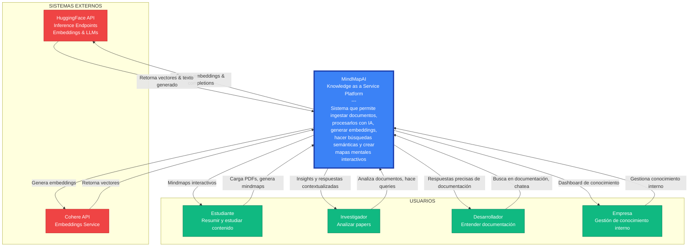
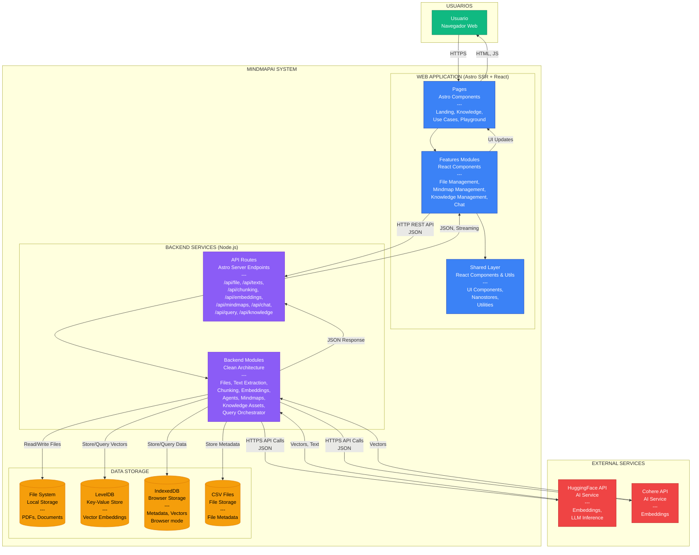
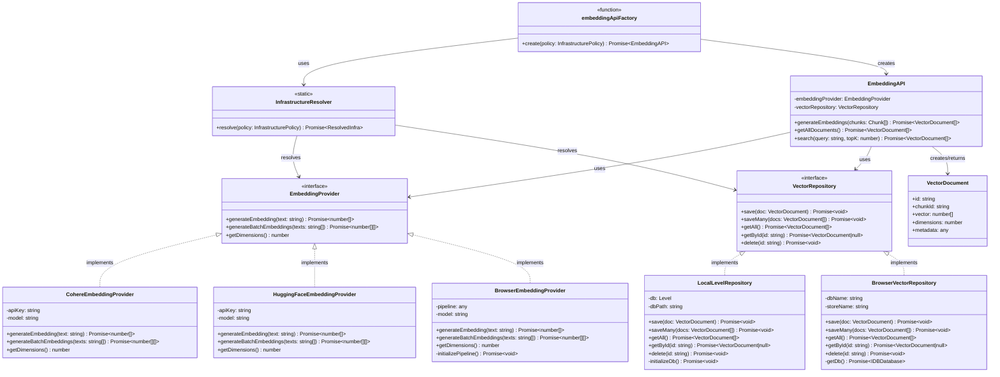
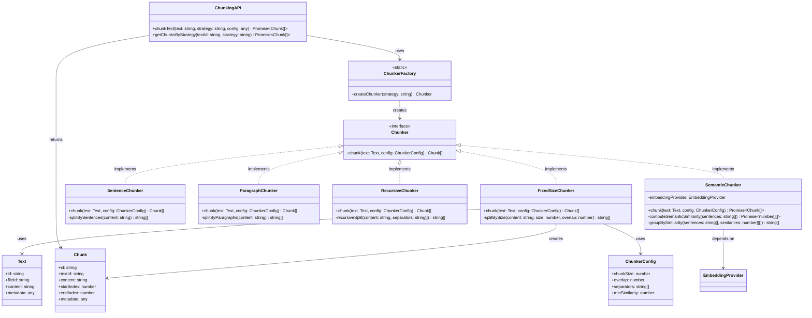
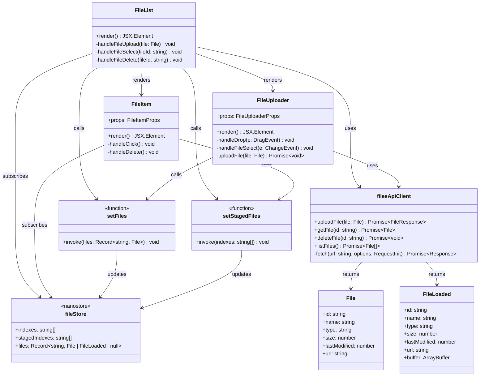

# Diagramas C4 - MindMapAI

El modelo C4 (Context, Containers, Components, Code) proporciona una forma jerárquica de visualizar la arquitectura de software en diferentes niveles de abstracción.

---

## 📍 Nivel 1: Diagrama de Contexto (Context)

Muestra el sistema en su contexto más amplio, incluyendo usuarios y sistemas externos.

### Descripción del Contexto

**Sistema**: MindMapAI - Knowledge as a Service Platform

**Propósito**: Proporcionar un backend de conocimiento para LLMs que permite:
- Ingestar y procesar documentos (PDFs)
- Generar embeddings vectoriales para búsqueda semántica
- Recuperar contexto relevante mediante RAG
- Generar mapas mentales interactivos con IA
- Chat inteligente con contexto de documentos

**Usuarios**:
1. **Estudiantes**: Cargan PDFs educativos, generan resúmenes y mindmaps para estudiar
2. **Investigadores**: Analizan múltiples papers, extraen insights mediante queries semánticas
3. **Desarrolladores**: Buscan en documentación técnica, obtienen respuestas contextualizadas
4. **Empresas**: Gestionan conocimiento interno, indexan políticas y manuales

**Sistemas Externos**:
1. **HuggingFace API**: Servicio de inferencia para embeddings y LLMs
2. **Cohere API**: Servicio de embeddings de alta calidad

---

## 📦 Nivel 2: Diagrama de Contenedores (Containers)

Muestra los contenedores técnicos (aplicaciones, servicios, bases de datos) que componen el sistema.

### Descripción de Contenedores

#### 1. **Web Application (Astro SSR + React)**
- **Tecnología**: Astro 5, React 19, Tailwind CSS 4, TypeScript
- **Responsabilidad**: Interfaz de usuario, renderizado SSR, gestión de estado local
- **Componentes**:
  - **Pages**: Rutas y páginas Astro (SSR)
  - **Features**: Módulos de funcionalidad autocontenidos (React)
  - **Shared**: Componentes y utilidades compartidas

#### 2. **Backend Services (Node.js)**
- **Tecnología**: Node.js, TypeScript, Astro API Routes
- **Responsabilidad**: Lógica de negocio, orquestación de servicios, API REST
- **Componentes**:
  - **API Routes**: Endpoints HTTP que exponen servicios
  - **Backend Modules**: Módulos de dominio con Clean Architecture

#### 3. **Data Storage**
- **File System**: Almacenamiento de archivos PDF (servidor)
- **LevelDB**: Base de datos key-value para vectores (servidor)
- **IndexedDB**: Base de datos browser para modo offline
- **CSV Files**: Archivos CSV para metadatos (servidor)

#### 4. **External Services**
- **HuggingFace API**: Embeddings y LLM inference
- **Cohere API**: Embeddings de alta calidad

---

## 🔧 Nivel 3: Diagrama de Componentes (Components)

Muestra los componentes dentro de cada contenedor y sus relaciones.

### 3.1 Componentes del Backend

```mermaid
graph TB
    subgraph API["API ROUTES LAYER"]
        FileRoute[File Router<br/>GET, POST, DELETE /api/file]
        TextRoute[Text Router<br/>GET, POST, DELETE /api/texts]
        ChunkRoute[Chunking Router<br/>POST /api/chunking/index]
        EmbedRoute[Embeddings Router<br/>GET, POST, PUT /api/embeddings]
        MindmapRoute[Mindmap Router<br/>POST /api/mindmaps]
        ChatRoute[Chat Router<br/>POST /api/chat]
        QueryRoute[Query Router<br/>POST /api/query]
        KnowledgeRoute[Knowledge Router<br/>POST /api/knowledge]
    end

    subgraph Files["FILES MODULE"]
        FilesAPI[Files API<br/>uploadFile, getFile,<br/>deleteFile, listFiles]
        FileStorage[File Storage<br/>Interface]
        FileRepo[File Repository<br/>Interface]
        LocalFS[LocalFsStorage<br/>Implementation]
        BrowserFS[BrowserStorage<br/>Implementation]
        LocalCSV[LocalCsvRepository<br/>Implementation]
        BrowserRepo[BrowserRepository<br/>Implementation]
    end

    subgraph TextExtraction["TEXT EXTRACTION MODULE"]
        TextAPI[Text Extractor API<br/>extractTextFromPDF,<br/>getAllTexts, removeText]
        PDFExtractor[PDF Extractor<br/>pdfjs-dist wrapper]
        TextCleaner[Text Cleaner<br/>Preprocessing]
        TextRepo[Text Repository<br/>Interface]
    end

    subgraph Chunking["CHUNKING MODULE"]
        ChunkAPI[Chunking API<br/>chunkText,<br/>getChunksByStrategy]
        ChunkerFactory[Chunker Factory<br/>Strategy selector]
        FixedSize[Fixed Size Chunker]
        Sentence[Sentence Chunker]
        Paragraph[Paragraph Chunker]
        Recursive[Recursive Chunker]
        Semantic[Semantic Chunker]
        ChunkRepo[Chunk Repository<br/>Interface]
    end

    subgraph Embeddings["EMBEDDINGS MODULE"]
        EmbedAPI[Embedding API<br/>generateEmbeddings,<br/>search, getAllDocuments]
        EmbedProvider[Embedding Provider<br/>Interface]
        CohereProvider[Cohere Provider<br/>embed-english-v3.0]
        HFProvider[HuggingFace Provider<br/>sentence-transformers]
        BrowserProvider[Browser Provider<br/>@xenova/transformers]
        VectorRepo[Vector Repository<br/>Interface]
        LevelRepo[LocalLevelRepository<br/>LevelDB]
        BrowserVectorRepo[BrowserRepository<br/>IndexedDB]
    end

    subgraph Agents["AGENTS/AI MODULE"]
        AgentsAPI[Agents API<br/>streamCompletion,<br/>generateCompletion]
        AIProvider[AI Provider<br/>Interface]
        AISDKProvider[AI SDK Provider<br/>DeepSeek-V3]
        HFAIProvider[HuggingFace AI Provider<br/>Various models]
    end

    subgraph Mindmaps["MINDMAPS MODULE"]
        MindmapAPI[Mindmap API<br/>generateMindmapFromFile,<br/>generateMindmapStream]
        MindmapUseCase[Mindmap Use Cases<br/>Orchestration]
    end

    subgraph KnowledgeAssets["KNOWLEDGE ASSETS MODULE"]
        KnowledgeAPI[Knowledge API<br/>generateNewKnowledge]
        KnowledgeUseCase[Knowledge Use Cases<br/>Pipeline orchestration]
        KnowledgeRepo[Knowledge Repository<br/>Interface]
    end

    subgraph QueryOrch["QUERY ORCHESTRATOR MODULE"]
        QueryAPI[Query API<br/>queryWithContext]
        QueryUseCase[Query Use Cases<br/>RAG pipeline]
    end

    %% API to Modules
    FileRoute --> FilesAPI
    TextRoute --> TextAPI
    ChunkRoute --> ChunkAPI
    EmbedRoute --> EmbedAPI
    MindmapRoute --> MindmapAPI
    ChatRoute --> AgentsAPI
    QueryRoute --> QueryAPI
    KnowledgeRoute --> KnowledgeAPI

    %% Files Module
    FilesAPI --> FileStorage
    FilesAPI --> FileRepo
    FileStorage -.Implementation.- LocalFS
    FileStorage -.Implementation.- BrowserFS
    FileRepo -.Implementation.- LocalCSV
    FileRepo -.Implementation.- BrowserRepo

    %% Text Extraction Module
    TextAPI --> PDFExtractor
    TextAPI --> TextCleaner
    TextAPI --> TextRepo

    %% Chunking Module
    ChunkAPI --> ChunkerFactory
    ChunkerFactory --> FixedSize
    ChunkerFactory --> Sentence
    ChunkerFactory --> Paragraph
    ChunkerFactory --> Recursive
    ChunkerFactory --> Semantic
    ChunkAPI --> ChunkRepo

    %% Embeddings Module
    EmbedAPI --> EmbedProvider
    EmbedAPI --> VectorRepo
    EmbedProvider -.Implementation.- CohereProvider
    EmbedProvider -.Implementation.- HFProvider
    EmbedProvider -.Implementation.- BrowserProvider
    VectorRepo -.Implementation.- LevelRepo
    VectorRepo -.Implementation.- BrowserVectorRepo

    %% Agents Module
    AgentsAPI --> AIProvider
    AIProvider -.Implementation.- AISDKProvider
    AIProvider -.Implementation.- HFAIProvider

    %% Mindmaps Module
    MindmapAPI --> MindmapUseCase
    MindmapUseCase --> FilesAPI
    MindmapUseCase --> TextAPI
    MindmapUseCase --> AgentsAPI

    %% Knowledge Assets Module
    KnowledgeAPI --> KnowledgeUseCase
    KnowledgeUseCase --> FilesAPI
    KnowledgeUseCase --> TextAPI
    KnowledgeUseCase --> ChunkAPI
    KnowledgeUseCase --> EmbedAPI
    KnowledgeUseCase --> KnowledgeRepo

    %% Query Orchestrator Module
    QueryAPI --> QueryUseCase
    QueryUseCase --> EmbedAPI
    QueryUseCase --> AgentsAPI

    %% Styling
    classDef api fill:#3b82f6,stroke:#1e40af,color:#fff
    classDef module fill:#8b5cf6,stroke:#6d28d9,color:#fff
    classDef contract fill:#f59e0b,stroke:#d97706,color:#000
    classDef impl fill:#10b981,stroke:#047857,color:#fff

    class FileRoute,TextRoute,ChunkRoute,EmbedRoute,MindmapRoute,ChatRoute,QueryRoute,KnowledgeRoute api
    class FilesAPI,TextAPI,ChunkAPI,EmbedAPI,AgentsAPI,MindmapAPI,KnowledgeAPI,QueryAPI module
    class FileStorage,FileRepo,EmbedProvider,VectorRepo,AIProvider,TextRepo,ChunkRepo,KnowledgeRepo contract
    class LocalFS,BrowserFS,LocalCSV,BrowserRepo,CohereProvider,HFProvider,BrowserProvider,LevelRepo,BrowserVectorRepo,AISDKProvider,HFAIProvider,PDFExtractor,TextCleaner,FixedSize,Sentence,Paragraph,Recursive,Semantic impl
```

### 3.2 Componentes del Frontend

```mermaid
graph TB
    subgraph Pages["PAGES LAYER"]
        Landing[Landing Page<br/>index.astro]
        KnowGen[Knowledge Generator<br/>/knowledge/generator]
        KnowAssets[Knowledge Assets<br/>/knowledge/assets]
        KnowFiles[Knowledge Files<br/>/knowledge/files]
        MindmapGen[Mindmap Generator<br/>/use-cases/generator]
        MindmapEditor[Mindmap Editor<br/>/use-cases/mindmaps]
        ChatPage[Chat Page<br/>/use-cases/chat]
        ChunkerPlayground[Chunker Playground<br/>/playground/chunker]
    end

    subgraph FileManagement["FILE MANAGEMENT FEATURE"]
        FileList[FileList<br/>React Component<br/>Lista de archivos]
        FileItem[FileItem<br/>React Component<br/>Archivo individual]
        FileUploader[FileUploader<br/>React Component<br/>Drag & drop]
        LibrarySelector[LibraryFileSelector<br/>React Component<br/>Selector biblioteca]
        FileStore[fileStore<br/>Nanostore<br/>Estado de archivos]
        FilesClient[filesApi Client<br/>API wrapper]
    end

    subgraph MindmapMgmt["MINDMAP MANAGEMENT FEATURE"]
        TextEditor[MindmapTextEditor<br/>Astro Component<br/>CodeMirror editor]
        MarkmapView[MarkmapView<br/>Astro Component<br/>Visualización]
        MarkMapViewer[MarkMapViewer<br/>TypeScript Class<br/>Controlador]
        MindmapStore[currentMindmap<br/>Nanostore<br/>Estado del mindmap]
        QueryStoreM[queryStore<br/>Nanostore<br/>Query y estilo]
        MindmapClient[mindmapApi Client<br/>API wrapper]
    end

    subgraph KnowledgeMgmt["KNOWLEDGE MANAGEMENT FEATURE"]
        KnowDashboard[KnowledgeManagement<br/>React Component<br/>Dashboard]
        FlowStep[FlowStep<br/>React Component<br/>Paso visual]
        KnowClient[knowledgeApi Client<br/>API wrapper]
    end

    subgraph ChatFeature["CHAT FEATURE"]
        ChatUI[Chat<br/>Astro Component<br/>UI de chat]
        ChatMgr[ChatManager<br/>TypeScript Class<br/>Lógica de streaming]
        ChatStore[chatStore<br/>Nanostore<br/>Mensajes]
        ChatClient[chatApi Client<br/>API wrapper]
    end

    subgraph SharedLayer["SHARED LAYER"]
        Switch[Switch<br/>React Component<br/>Toggle]
        Spinner[Spinner<br/>React Component<br/>Loading]
        Sidebar[Sidebar<br/>Astro Component<br/>Navegación]
        FlowStepShared[FlowStep<br/>React Component<br/>Paso compartido]
        UtilsSC[sc Utility<br/>clsx wrapper]
        UtilsShuffle[shuffleArray<br/>Array utility]
    end

    subgraph Layouts["LAYOUTS"]
        BaseLayout[Layout.astro<br/>Layout base]
        DashLayout[DashboardLayout.astro<br/>Layout con sidebar]
    end

    %% Pages to Features
    Landing --> BaseLayout
    KnowGen --> DashLayout
    KnowAssets --> DashLayout
    KnowFiles --> DashLayout
    MindmapGen --> DashLayout
    MindmapEditor --> DashLayout
    ChatPage --> DashLayout
    ChunkerPlayground --> DashLayout

    KnowGen --> KnowDashboard
    KnowFiles --> FileList
    MindmapGen --> MindmapStore
    MindmapGen --> QueryStoreM
    MindmapEditor --> TextEditor
    MindmapEditor --> MarkmapView
    ChatPage --> ChatUI

    %% Feature components
    FileList --> FileItem
    FileList --> FileUploader
    FileList --> FileStore
    FileItem --> FileStore
    FileUploader --> FilesClient
    LibrarySelector --> FileStore

    TextEditor --> MindmapStore
    TextEditor --> MarkMapViewer
    MarkmapView --> MarkMapViewer
    MarkmapView --> MindmapStore
    MarkMapViewer --> MindmapClient
    QueryStoreM --> MindmapClient

    KnowDashboard --> FlowStep
    KnowDashboard --> KnowClient

    ChatUI --> ChatMgr
    ChatMgr --> ChatStore
    ChatMgr --> ChatClient

    %% Shared layer usage
    FileList --> Switch
    FileList --> UtilsSC
    KnowDashboard --> Spinner
    KnowDashboard --> FlowStepShared
    DashLayout --> Sidebar

    %% API calls to backend
    FilesClient -->|HTTP POST/GET/DELETE| FileRoute[Backend: /api/file]
    MindmapClient -->|HTTP POST streaming| MindmapRoute[Backend: /api/mindmaps]
    KnowClient -->|HTTP POST| KnowledgeRoute[Backend: /api/knowledge]
    ChatClient -->|HTTP POST streaming| ChatRoute[Backend: /api/chat]

    %% Styling
    classDef page fill:#3b82f6,stroke:#1e40af,color:#fff
    classDef feature fill:#8b5cf6,stroke:#6d28d9,color:#fff
    classDef shared fill:#10b981,stroke:#047857,color:#fff
    classDef layout fill:#f59e0b,stroke:#d97706,color:#000
    classDef store fill:#ec4899,stroke:#be185d,color:#fff
    classDef client fill:#06b6d4,stroke:#0891b2,color:#fff

    class Landing,KnowGen,KnowAssets,KnowFiles,MindmapGen,MindmapEditor,ChatPage,ChunkerPlayground page
    class FileList,FileItem,FileUploader,LibrarySelector,TextEditor,MarkmapView,MarkMapViewer,KnowDashboard,FlowStep,ChatUI,ChatMgr feature
    class Switch,Spinner,Sidebar,FlowStepShared,UtilsSC,UtilsShuffle shared
    class BaseLayout,DashLayout layout
    class FileStore,MindmapStore,QueryStoreM,ChatStore store
    class FilesClient,MindmapClient,KnowClient,ChatClient client
```

---

## 💻 Nivel 4: Diagrama de Código (Code)

Muestra la estructura de clases/interfaces de un componente específico.

### 4.1 Módulo de Embeddings - Código

### 4.2 Módulo de Chunking - Código

### 4.3 Feature File Management - Código

---

## 📊 Resumen de los Diagramas C4

### Nivel 1: Contexto
- **Vista**: Sistema completo en su entorno
- **Audiencia**: Stakeholders no técnicos
- **Elementos**: Usuarios, Sistema MindMapAI, Sistemas Externos

### Nivel 2: Contenedores
- **Vista**: Aplicaciones y servicios que componen el sistema
- **Audiencia**: Arquitectos de software, DevOps
- **Elementos**: Web App, Backend Services, Storages, External APIs

### Nivel 3: Componentes
- **Vista**: Componentes dentro de cada contenedor
- **Audiencia**: Desarrolladores, Arquitectos
- **Elementos**: Módulos backend, Features frontend, APIs, Repositorios

### Nivel 4: Código
- **Vista**: Clases, interfaces, métodos
- **Audiencia**: Desarrolladores
- **Elementos**: Clases TypeScript, Interfaces, Relaciones

---

## 🎯 Principios Arquitectónicos Reflejados

1. **Separation of Concerns**: Cada nivel tiene responsabilidades claras
2. **Dependency Inversion**: Interfaces separan contratos de implementaciones
3. **Strategy Pattern**: Múltiples implementaciones intercambiables (Chunkers, Providers)
4. **Repository Pattern**: Abstracción de persistencia
5. **Clean Architecture**: Capas Domain → Application → Infrastructure
6. **Feature-Sliced Design**: Features autocontenidos en frontend
7. **Reactive State Management**: Nanostores para estado global reactivo

---

## 📈 Beneficios de la Arquitectura C4

1. **Comunicación**: Diferentes niveles para diferentes audiencias
2. **Documentación**: Vistas jerárquicas desde contexto hasta código
3. **Comprensión**: Fácil entender el sistema a cualquier nivel
4. **Mantenibilidad**: Identificar responsabilidades y dependencias
5. **Evolución**: Planificar cambios en el nivel adecuado
