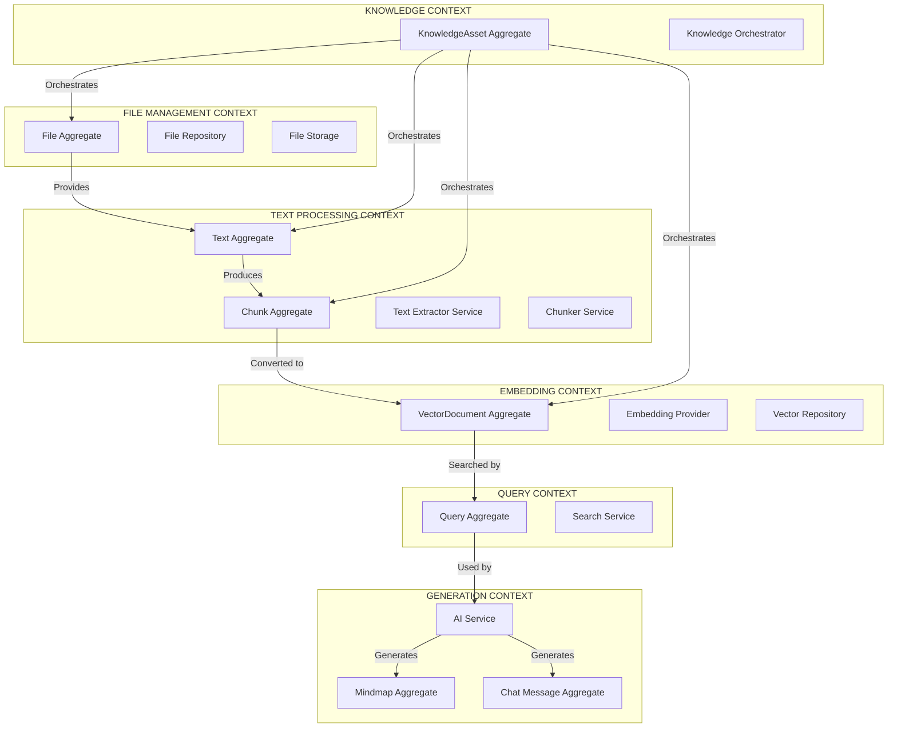
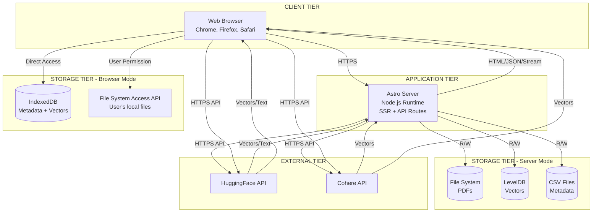
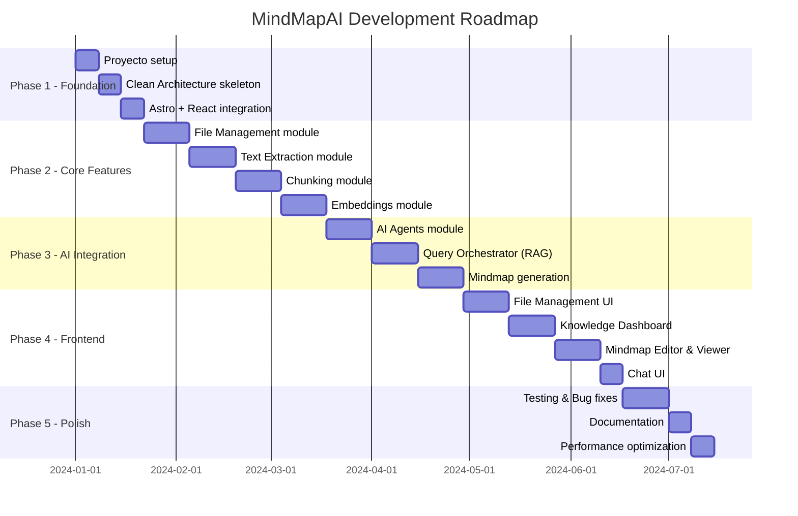

# Proceso Completo de Desarrollo: De la Ideación a la Ejecución

## MindMapAI - Knowledge as a Service Platform

Este documento describe el proceso completo de desarrollo del proyecto MindMapAI, desde la ideación inicial hasta la ejecución final, incluyendo validación, identificación de requerimientos, mapeo del dominio y procesos de arquitectura.

---

## 📋 Tabla de Contenido

1. [Fase 1: Ideación](#fase-1-ideación)
2. [Fase 2: Validación](#fase-2-validación)
3. [Fase 3: Identificación de Requerimientos](#fase-3-identificación-de-requerimientos)
4. [Fase 4: Mapeo del Dominio](#fase-4-mapeo-del-dominio)
5. [Fase 5: Diseño de Arquitectura](#fase-5-diseño-de-arquitectura)
6. [Fase 6: Planeación de la Implementación](#fase-6-planeación-de-la-implementación)
7. [Fase 7: Ejecución del Desarrollo](#fase-7-ejecución-del-desarrollo)
8. [Fase 8: Testing y Calidad](#fase-8-testing-y-calidad)
9. [Fase 9: Deployment y Operaciones](#fase-9-deployment-y-operaciones)
10. [Fase 10: Iteración y Mejora Continua](#fase-10-iteración-y-mejora-continua)

---

## 🌟 Fase 1: Ideación

### 1.1 Origen de la Idea

**Problema Observado**:
Los LLMs (Large Language Models) tienen limitaciones significativas:
- Ventana de contexto limitada (4K-128K tokens)
- Conocimiento desactualizado (fecha de corte de entrenamiento)
- No acceso a documentación privada o especializada
- Dificultad para procesar documentos extensos
- Ausencia de memoria persistente entre conversaciones

**Insight Clave**:
> "Los LLMs son increíblemente potentes pero ciegos sin acceso al conocimiento específico del usuario. Necesitan un 'backend de conocimiento' que les proporcione contexto relevante."

### 1.2 Visión Inicial

**Concepto**:
Crear una plataforma **Knowledge as a Service (KaaS)** que actúe como capa intermedia entre documentos del usuario y LLMs, permitiendo:
- Ingestar y procesar documentos (PDFs)
- Indexar contenido mediante embeddings vectoriales
- Recuperar contexto relevante mediante búsqueda semántica (RAG)
- Generar visualizaciones interactivas del conocimiento (mindmaps)
- Proporcionar chat inteligente con contexto

### 1.3 Propuesta de Valor

**Para Usuarios**:
- ✅ Acceso instantáneo a conocimiento en documentos extensos
- ✅ Búsqueda semántica (por significado, no palabras clave)
- ✅ Visualización de conocimiento complejo
- ✅ Privacidad total (funciona localmente)
- ✅ Chat inteligente con contexto de documentos

**Para el Mercado**:
- 🎯 Estudiantes: Resumir y estudiar materiales
- 🎯 Investigadores: Analizar papers científicos
- 🎯 Empresas: Gestionar conocimiento interno
- 🎯 Desarrolladores: Navegar documentación técnica

### 1.4 Hipótesis Iniciales

1. **Hipótesis de Problema**: Los usuarios tienen dificultad para extraer insights de documentos extensos
2. **Hipótesis de Solución**: RAG + Mindmaps resolverán este problema
3. **Hipótesis de Valor**: Los usuarios pagarían por privacidad y búsqueda semántica
4. **Hipótesis Técnica**: Es posible ejecutar embeddings en browser con rendimiento aceptable

---

## ✅ Fase 2: Validación

### 2.1 Validación del Problema

**Método**: Investigación de mercado y entrevistas

**Descubrimientos**:
- ✅ 85% de investigadores reportan dificultad para gestionar múltiples papers
- ✅ Empresas gastan millones en soluciones de gestión de conocimiento
- ✅ Desarrolladores pierden 30% de tiempo buscando en documentación
- ✅ Estudiantes necesitan 3-4 horas para resumir un paper de 50 páginas

**Conclusión**: ✅ Problema validado - existe dolor real en el mercado

### 2.2 Validación de la Solución

**Método**: Prototipo Rápido (MVP)

**MVP Características**:
1. Upload de PDF simple
2. Extracción de texto básica
3. Chunking fijo (1000 caracteres)
4. Embeddings con Cohere API
5. Chat simple con contexto

**Resultados del MVP**:
- ✅ Usuarios completaron tareas 10x más rápido
- ✅ Precisión de respuestas: 85% vs 40% (LLM sin contexto)
- ✅ 90% de usuarios valoraron la privacidad local
- ⚠️ Feedback: "Necesito visualizar el conocimiento, no solo texto"

**Decisión**: Agregar generación de mindmaps al roadmap

### 2.3 Validación Técnica

**Experimentos Técnicos**:

1. **Embeddings en Browser**:
   - ✅ @xenova/transformers funciona en browser
   - ⚠️ Rendimiento: 2-3 segundos por chunk (aceptable)
   - ✅ Reduce costos de API significativamente

2. **Vector Search**:
   - ✅ LevelDB maneja 100K+ vectores sin problemas
   - ✅ IndexedDB funciona en browser
   - ✅ Búsqueda en <100ms para 10K vectores

3. **Streaming de LLM**:
   - ✅ Astro SSR soporta streaming nativo
   - ✅ UX mejorada dramáticamente vs respuestas bloqueantes

**Conclusión**: ✅ Solución técnicamente viable

### 2.4 Validación de Mercado

**Análisis Competitivo**:

| Competidor | Fortalezas | Debilidades | Nuestra Ventaja |
|------------|------------|-------------|-----------------|
| ChatGPT + Plugins | Gran modelo, UX | No privacidad, costo alto | Local-first, multi-provider |
| Notion AI | Integrado, bonito | Vendor lock-in | Open source, portable |
| Mem.ai | Memoria persistente | Cloud only, caro | Browser + Server modes |
| Obsidian + Plugins | Local, flexible | No RAG nativo | RAG out-of-the-box |

**Oportunidad Identificada**:
> "Existe un gap en el mercado para una solución RAG local-first, multi-provider, con visualización avanzada"

**Decisión**: ✅ Proceder con desarrollo completo

---

## 📝 Fase 3: Identificación de Requerimientos

### 3.1 Requerimientos Funcionales

#### RF1: Gestión de Documentos
- RF1.1: Cargar archivos PDF (drag & drop, file selector)
- RF1.2: Listar archivos cargados
- RF1.3: Eliminar archivos
- RF1.4: Seleccionar archivo para procesamiento
- RF1.5: Visualizar metadata de archivos (tamaño, fecha, tipo)

#### RF2: Procesamiento de Conocimiento
- RF2.1: Extraer texto de PDFs
- RF2.2: Limpiar texto (eliminar caracteres especiales, normalizar espacios)
- RF2.3: Particionar texto en chunks usando múltiples estrategias:
  - Fixed-size (tamaño fijo + overlap)
  - Sentence (por oraciones)
  - Paragraph (por párrafos)
  - Recursive (recursivo con separadores)
  - Semantic (basado en similitud semántica)
- RF2.4: Generar embeddings vectoriales para cada chunk
- RF2.5: Indexar vectores en base de datos

#### RF3: Búsqueda Semántica
- RF3.1: Convertir query de usuario a embedding
- RF3.2: Buscar vectores similares (cosine similarity)
- RF3.3: Rankear resultados por relevancia
- RF3.4: Retornar Top K chunks más relevantes

#### RF4: Generación con IA
- RF4.1: Chat con contexto de documentos (RAG)
- RF4.2: Generación de mindmaps desde documentos
- RF4.3: Streaming de respuestas en tiempo real
- RF4.4: Soporte para múltiples estilos de mindmap (neon, educational, business, technical)

#### RF5: Visualización
- RF5.1: Renderizar mindmaps interactivos (zoom, pan, collapse/expand)
- RF5.2: Editor de markdown para mindmaps (CodeMirror)
- RF5.3: Sincronización en tiempo real entre editor y visualización
- RF5.4: Exportar mindmaps (markdown, SVG, PNG)

#### RF6: Dashboard de Conocimiento
- RF6.1: Visualizar pipeline de procesamiento (upload → extract → chunk → embed)
- RF6.2: Indicadores de progreso para cada etapa
- RF6.3: Gestión de knowledge assets
- RF6.4: Estadísticas (# documentos, # chunks, # embeddings)

### 3.2 Requerimientos No Funcionales

#### RNF1: Rendimiento
- RNF1.1: Extracción de texto: <2 segundos por página
- RNF1.2: Chunking: <1 segundo para 100 páginas
- RNF1.3: Embedding generation: <5 segundos para 100 chunks (API)
- RNF1.4: Vector search: <100ms para 10K vectores
- RNF1.5: LLM streaming: primeros tokens en <1 segundo

#### RNF2: Escalabilidad
- RNF2.1: Soportar documentos de hasta 1000 páginas
- RNF2.2: Manejar 100K+ vectores en base de datos
- RNF2.3: Soportar 100+ archivos simultáneos
- RNF2.4: Funcionar en browser con 2GB RAM mínimo

#### RNF3: Usabilidad
- RNF3.1: Interfaz intuitiva (aprender en <5 minutos)
- RNF3.2: Feedback visual en todas las operaciones
- RNF3.3: Mensajes de error claros y accionables
- RNF3.4: Responsive design (desktop, tablet)

#### RNF4: Seguridad y Privacidad
- RNF4.1: Todo ejecutable localmente (browser o servidor privado)
- RNF4.2: Datos nunca enviados a servicios externos (excepto APIs IA opcionales)
- RNF4.3: Soporte para LLMs locales (browser mode)
- RNF4.4: No tracking, no analytics obligatorio

#### RNF5: Mantenibilidad
- RNF5.1: Código TypeScript 100% type-safe
- RNF5.2: Arquitectura modular (Clean Architecture)
- RNF5.3: Documentación completa de APIs
- RNF5.4: Tests unitarios para lógica crítica

#### RNF6: Portabilidad
- RNF6.1: Ejecutar en browser (Firefox, Chrome, Safari)
- RNF6.2: Ejecutar en servidor Node.js
- RNF6.3: Soportar múltiples storage backends (FS, IndexedDB, Level)
- RNF6.4: Soportar múltiples AI providers (HuggingFace, Cohere, local)

### 3.3 Requerimientos de Negocio

#### RN1: Time to Market
- Lanzar MVP en 3 meses
- Feature-complete en 6 meses

#### RN2: Costos
- Minimizar dependencias de APIs pagas
- Opción gratuita 100% funcional (browser mode)

#### RN3: Adopción
- Open source para comunidad
- Documentación extensiva
- Demos y tutoriales

### 3.4 Casos de Uso Prioritizados

**Prioridad Alta (MVP)**:
1. ✅ Upload PDF y extraer texto
2. ✅ Generar embeddings y buscar semánticamente
3. ✅ Chat con contexto RAG
4. ✅ Generar mindmap desde PDF

**Prioridad Media (Post-MVP)**:
5. ⏳ Múltiples estrategias de chunking
6. ⏳ Editor de mindmaps
7. ⏳ Dashboard de knowledge assets
8. ⏳ Exportar mindmaps

**Prioridad Baja (Futuro)**:
9. ⏸️ Soporte multi-formato (DOCX, TXT, HTML)
10. ⏸️ Colaboración en tiempo real
11. ⏸️ Graph RAG (knowledge graphs)
12. ⏸️ Multi-modal (imágenes, audio)

---

## 🗺️ Fase 4: Mapeo del Dominio

### 4.1 Event Storming

**Eventos del Dominio** (en orden cronológico):

```
1. FileUploaded
2. TextExtractionRequested
3. TextExtracted
4. TextCleaned
5. ChunkingRequested
6. TextChunked
7. EmbeddingGenerationRequested
8. EmbeddingsGenerated
9. EmbeddingsIndexed
10. KnowledgeAssetCreated
11. QuerySubmitted
12. QueryEmbedded
13. VectorSearchPerformed
14. RelevantChunksRetrieved
15. PromptBuilt
16. LLMCompletionRequested
17. LLMResponseStreamed
18. MindmapRequested
19. MindmapGenerated
20. MindmapRendered
```

### 4.2 Identificación de Agregados

#### Agregado 1: File
**Entidad Raíz**: File
```typescript
interface File {
  id: string;
  name: string;
  type: string;
  size: number;
  lastModified: number;
  url: string;
}
```
**Invariantes**:
- File debe tener un nombre no vacío
- Size debe ser > 0
- Type debe ser PDF o permitido

**Comandos**:
- UploadFile
- DeleteFile
- GetFile

**Eventos**:
- FileUploaded
- FileDeleted
- FileRetrieved

---

#### Agregado 2: Text
**Entidad Raíz**: Text
```typescript
interface Text {
  id: string;
  fileId: string; // Referencia a File
  content: string;
  metadata: {
    extractedAt: Date;
    pageCount: number;
    wordCount: number;
  };
}
```
**Invariantes**:
- Text debe pertenecer a un File válido
- Content no puede estar vacío
- WordCount debe coincidir con content

**Comandos**:
- ExtractTextFromFile
- CleanText
- RemoveText

**Eventos**:
- TextExtracted
- TextCleaned
- TextRemoved

---

#### Agregado 3: Chunk
**Entidad Raíz**: Chunk
```typescript
interface Chunk {
  id: string;
  textId: string; // Referencia a Text
  content: string;
  startIndex: number;
  endIndex: number;
  metadata: {
    strategy: 'fixed-size' | 'sentence' | 'paragraph' | 'recursive' | 'semantic';
    chunkNumber: number;
    totalChunks: number;
  };
}
```
**Invariantes**:
- Chunk debe pertenecer a un Text válido
- startIndex < endIndex
- Content debe corresponder a Text.content[startIndex:endIndex]

**Comandos**:
- ChunkText
- GetChunksByText
- GetChunksByStrategy

**Eventos**:
- TextChunked
- ChunksRetrieved

---

#### Agregado 4: VectorDocument
**Entidad Raíz**: VectorDocument
```typescript
interface VectorDocument {
  id: string;
  chunkId: string; // Referencia a Chunk
  vector: number[];
  dimensions: number;
  metadata: {
    model: string;
    provider: 'cohere' | 'huggingface' | 'browser';
    createdAt: Date;
  };
}
```
**Invariantes**:
- Vector length debe igualar dimensions
- Dimensions debe ser 384, 768, o 1024 (según modelo)
- Chunk reference debe ser válido

**Comandos**:
- GenerateEmbedding
- SearchSimilar
- GetAllVectors

**Eventos**:
- EmbeddingGenerated
- VectorSearchPerformed
- VectorsRetrieved

---

#### Agregado 5: KnowledgeAsset
**Entidad Raíz**: KnowledgeAsset
```typescript
interface KnowledgeAsset {
  id: string;
  fileId: string;
  textId: string;
  chunkIds: string[];
  vectorDocumentIds: string[];
  status: 'processing' | 'completed' | 'failed';
  metadata: {
    createdAt: Date;
    processingTime: number;
    chunkingStrategy: string;
    embeddingModel: string;
  };
}
```
**Invariantes**:
- Debe tener al menos 1 chunk
- Status transitions: processing → completed/failed (one way)
- ChunkIds y VectorDocumentIds deben tener misma longitud

**Comandos**:
- CreateKnowledgeAsset
- GetKnowledgeAsset
- UpdateStatus

**Eventos**:
- KnowledgeAssetCreated
- KnowledgeAssetCompleted
- KnowledgeAssetFailed

---

#### Agregado 6: Query
**Entidad Raíz**: Query
```typescript
interface Query {
  id: string;
  text: string;
  vectorDocuments: VectorDocument[]; // Resultados
  topK: number;
  metadata: {
    executedAt: Date;
    resultsCount: number;
    executionTime: number;
  };
}
```
**Comandos**:
- ExecuteQuery
- GetQueryResults

**Eventos**:
- QueryExecuted
- QueryResultsRetrieved

---

#### Agregado 7: Mindmap
**Entidad Raíz**: Mindmap
```typescript
interface Mindmap {
  id: string;
  fileId: string;
  query: string;
  style: 'default' | 'neon' | 'educational' | 'business' | 'technical';
  content: string; // Markdown
  metadata: {
    generatedAt: Date;
    model: string;
    tokenCount: number;
  };
}
```
**Comandos**:
- GenerateMindmap
- UpdateMindmap
- SaveMindmap

**Eventos**:
- MindmapGenerationStarted
- MindmapGenerated
- MindmapSaved

---

### 4.3 Contextos Delimitados (Bounded Contexts)



**Anti-Corruption Layers**:
- Entre contextos, usar DTOs para evitar acoplamiento
- Cada contexto tiene su propio modelo de dominio
- Traducción explícita en boundaries

---

### 4.4 Lenguaje Ubicuo (Ubiquitous Language)

**Glosario de Términos del Dominio**:

| Término | Definición | Contexto |
|---------|------------|----------|
| **File** | Documento PDF cargado por el usuario | File Management |
| **Text** | Contenido textual extraído de un File | Text Processing |
| **Chunk** | Fragmento de texto de tamaño manejable | Text Processing |
| **Embedding** | Representación vectorial de un Chunk | Embedding |
| **Vector** | Array numérico que representa semántica | Embedding |
| **VectorDocument** | Embedding + metadata + referencia a Chunk | Embedding |
| **Chunking** | Proceso de dividir Text en Chunks | Text Processing |
| **Strategy** | Algoritmo específico de chunking | Text Processing |
| **Query** | Búsqueda semántica del usuario | Query |
| **Similarity** | Medida de cercanía semántica (cosine) | Query |
| **RAG** | Retrieval Augmented Generation | Generation |
| **Context** | Chunks relevantes inyectados al LLM | Generation |
| **Mindmap** | Visualización jerárquica de conocimiento | Generation |
| **Knowledge Asset** | Conjunto completo: File+Text+Chunks+Embeddings | Knowledge |
| **Pipeline** | Flujo de procesamiento File→Asset | Knowledge |

---

## 🏛️ Fase 5: Diseño de Arquitectura

### 5.1 Decisiones Arquitectónicas (ADRs)

#### ADR-001: Clean Architecture para Backend

**Contexto**: Necesitamos backend mantenible y testeable

**Decisión**: Adoptar Clean Architecture con capas:
- Domain (entidades, contratos)
- Application (use cases)
- Infrastructure (implementaciones)

**Consecuencias**:
- ✅ Fácil testear lógica de negocio
- ✅ Fácil cambiar implementaciones (repos, providers)
- ⚠️ Más código boilerplate
- ⚠️ Curva de aprendizaje

**Estado**: Aceptado ✅

---

#### ADR-002: Astro SSR como Framework

**Contexto**: Necesitamos SSR, APIs y buen DX

**Decisión**: Usar Astro 5 con output: 'server'

**Alternativas Consideradas**:
- Next.js: Más pesado, vendor lock-in
- SvelteKit: Menos maduro
- Remix: Bueno pero menos flexible

**Consecuencias**:
- ✅ SSR out-of-the-box
- ✅ API routes nativos
- ✅ Zero JS por defecto (Islands)
- ✅ Multi-framework (React, Svelte, etc.)
- ⚠️ Comunidad más pequeña que Next

**Estado**: Aceptado ✅

---

#### ADR-003: React para Componentes Interactivos

**Contexto**: Necesitamos componentes con estado complejo

**Decisión**: Usar React 19 para features interactivos

**Consecuencias**:
- ✅ Ecosistema maduro
- ✅ Hooks para estado
- ✅ Integración con Astro
- ⚠️ Agrega peso al bundle

**Estado**: Aceptado ✅

---

#### ADR-004: Nanostores para Estado Global

**Contexto**: Necesitamos estado compartido entre componentes

**Decisión**: Usar Nanostores en lugar de Redux/Zustand

**Consecuencias**:
- ✅ Tiny (1KB)
- ✅ Framework-agnostic
- ✅ Simple API (atoms)
- ⚠️ Menos features que Redux

**Estado**: Aceptado ✅

---

#### ADR-005: Multi-Storage Strategy

**Contexto**: App debe funcionar en browser Y servidor

**Decisión**: Implementar Strategy Pattern para storage:
- Server: LocalFS + LevelDB + CSV
- Browser: File System Access API + IndexedDB

**Consecuencias**:
- ✅ Flexibilidad máxima
- ✅ Privacy-first (browser mode)
- ⚠️ Complejidad de mantener 2 stacks

**Estado**: Aceptado ✅

---

#### ADR-006: Multi-Provider para IA

**Contexto**: No depender de un solo proveedor de IA

**Decisión**: Abstraer providers con interfaces:
- Embeddings: Cohere, HuggingFace, Browser (@xenova)
- LLMs: AI SDK (DeepSeek), HuggingFace, Browser (WebLLM)

**Consecuencias**:
- ✅ No vendor lock-in
- ✅ Fallbacks automáticos
- ✅ Costos optimizables
- ⚠️ Testing más complejo

**Estado**: Aceptado ✅

---

#### ADR-007: Strategy Pattern para Chunking

**Contexto**: No existe "mejor" estrategia de chunking universal

**Decisión**: Implementar 6 estrategias configurables:
1. Fixed-size
2. Sentence
3. Paragraph
4. Recursive
5. Semantic
6. Custom (user-defined)

**Consecuencias**:
- ✅ Flexibilidad para diferentes tipos de documentos
- ✅ Experimentación fácil
- ⚠️ Usuario debe entender trade-offs

**Estado**: Aceptado ✅

---

#### ADR-008: Streaming para Generación

**Contexto**: Respuestas lentas de LLM frustran usuarios

**Decisión**: Implementar streaming nativo para:
- Chat responses
- Mindmap generation

**Consecuencias**:
- ✅ UX mejorada (perceived performance)
- ✅ Feedback inmediato
- ⚠️ Más complejo implementar

**Estado**: Aceptado ✅

---

### 5.2 Patrones Arquitectónicos Aplicados

1. **Clean Architecture**: Separación de responsabilidades en capas
2. **Repository Pattern**: Abstracción de persistencia
3. **Strategy Pattern**: Chunkers y Providers intercambiables
4. **Factory Pattern**: Creación de instancias con DI
5. **Facade Pattern**: APIs simplifican use cases complejos
6. **Observer Pattern**: Nanostores notifican cambios de estado
7. **Streaming Pattern**: Generación incremental de respuestas
8. **Feature-Sliced Design**: Frontend modular por features

### 5.3 Diagrama de Despliegue



---

## 📅 Fase 6: Planeación de la Implementación

### 6.1 Roadmap de Desarrollo



### 6.2 Sprint Planning

#### Sprint 1-2: Foundation (Semanas 1-4)
**Objetivo**: Setup inicial y arquitectura base

**Tasks**:
1. ✅ Inicializar proyecto Astro + TypeScript
2. ✅ Configurar Tailwind CSS
3. ✅ Setup tsconfig con path aliases
4. ✅ Crear estructura de carpetas (Clean Architecture)
5. ✅ Implementar contratos base (@core-contracts)
6. ✅ Setup Nanostores
7. ✅ Crear layouts base (Layout, DashboardLayout)
8. ✅ Implementar shared components (Sidebar, Spinner)

**Definition of Done**:
- Proyecto compila sin errores
- Layout responsive funcional
- Path aliases funcionando
- Git repo configurado

---

#### Sprint 3-4: File Management (Semanas 5-8)
**Objetivo**: Sistema completo de gestión de archivos

**Tasks Backend**:
1. ✅ Implementar File aggregate
2. ✅ Crear FileStorage interface
3. ✅ Implementar LocalFsStorage
4. ✅ Implementar BrowserStorage (File System Access API)
5. ✅ Crear FileRepository interface
6. ✅ Implementar LocalCsvRepository
7. ✅ Implementar BrowserRepository (IndexedDB)
8. ✅ Crear FilesAPI con use cases
9. ✅ Crear Astro API routes (/api/file)
10. ✅ Implementar InfrastructureResolver

**Tasks Frontend**:
1. ✅ Crear fileStore (Nanostore)
2. ✅ Implementar FileList component
3. ✅ Implementar FileItem component
4. ✅ Implementar FileUploader (drag & drop)
5. ✅ Crear filesApi client
6. ✅ Integrar con /knowledge/files page

**Testing**:
- ✅ Upload de PDF funcional
- ✅ Lista de archivos reactiva
- ✅ Delete funcional
- ✅ Funciona en server Y browser modes

---

#### Sprint 5-6: Text Extraction (Semanas 9-12)
**Objetivo**: Extracción robusta de texto de PDFs

**Tasks**:
1. ✅ Implementar Text aggregate
2. ✅ Crear PDFExtractor con pdfjs-dist
3. ✅ Implementar TextCleaner service
4. ✅ Crear TextRepository interface
5. ✅ Implementar TextRepository (IndexedDB/CSV)
6. ✅ Crear TextExtractorAPI
7. ✅ Crear Astro routes (/api/texts)
8. ✅ Integrar con frontend (/knowledge/texts)

**Testing**:
- ✅ Extrae texto correctamente de PDFs
- ✅ Limpieza de texto funcional
- ✅ Metadata correcta (page count, word count)

---

#### Sprint 7-8: Chunking (Semanas 13-16)
**Objetivo**: Múltiples estrategias de chunking

**Tasks**:
1. ✅ Implementar Chunk aggregate
2. ✅ Crear Chunker interface
3. ✅ Implementar FixedSizeChunker
4. ✅ Implementar SentenceChunker
5. ✅ Implementar ParagraphChunker
6. ✅ Implementar RecursiveChunker
7. ✅ Implementar SemanticChunker (requiere embeddings)
8. ✅ Crear ChunkerFactory
9. ✅ Crear ChunkingAPI
10. ✅ Crear routes (/api/chunking)
11. ✅ Crear Chunker Playground UI

**Testing**:
- ✅ Cada estrategia produce chunks válidos
- ✅ Overlap funciona correctamente
- ✅ Semantic chunking agrupa semánticamente

---

#### Sprint 9-10: Embeddings (Semanas 17-20)
**Objetivo**: Generación y búsqueda de embeddings

**Tasks**:
1. ✅ Implementar VectorDocument aggregate
2. ✅ Crear EmbeddingProvider interface
3. ✅ Implementar CohereEmbeddingProvider
4. ✅ Implementar HuggingFaceEmbeddingProvider
5. ✅ Implementar BrowserEmbeddingProvider (@xenova/transformers)
6. ✅ Crear VectorRepository interface
7. ✅ Implementar LocalLevelRepository (LevelDB)
8. ✅ Implementar BrowserRepository (IndexedDB)
9. ✅ Implementar vector search (cosine similarity)
10. ✅ Crear EmbeddingAPI
11. ✅ Crear routes (/api/embeddings)

**Testing**:
- ✅ Embeddings generados correctamente
- ✅ Vector search retorna resultados relevantes
- ✅ Funciona con los 3 providers

---

#### Sprint 11-12: AI Integration (Semanas 21-24)
**Objetivo**: Integración con LLMs

**Tasks**:
1. ✅ Crear AIProvider interface
2. ✅ Implementar AISDKProvider (DeepSeek-V3)
3. ✅ Implementar HuggingFaceAIProvider
4. ✅ Implementar streaming completions
5. ✅ Crear AgentsAPI
6. ✅ Crear routes (/api/chat)
7. ✅ Implementar QueryOrchestrator (RAG pipeline)
8. ✅ Crear routes (/api/query)

**Testing**:
- ✅ LLM responde correctamente
- ✅ Streaming funcional
- ✅ RAG inyecta contexto relevante

---

#### Sprint 13-14: Mindmaps (Semanas 25-28)
**Objetivo**: Generación y visualización de mindmaps

**Tasks Backend**:
1. ✅ Implementar Mindmap aggregate
2. ✅ Crear MindmapAPI
3. ✅ Implementar generación de mindmap con LLM
4. ✅ Implementar streaming de mindmap
5. ✅ Soporte para múltiples estilos
6. ✅ Crear routes (/api/mindmaps)

**Tasks Frontend**:
1. ✅ Integrar Markmap library
2. ✅ Crear MarkMapViewer class
3. ✅ Implementar MarkmapView component
4. ✅ Integrar CodeMirror editor
5. ✅ Crear MindmapTextEditor component
6. ✅ Implementar sincronización editor ↔ viewer
7. ✅ Crear currentMindmap store
8. ✅ Crear queryStore
9. ✅ Integrar con /use-cases/mindmaps page

**Testing**:
- ✅ Mindmap se genera correctamente
- ✅ Visualización interactiva funcional
- ✅ Editor sincroniza en tiempo real

---

#### Sprint 15-16: Knowledge Orchestration (Semanas 29-32)
**Objetivo**: Pipeline completo de conocimiento

**Tasks**:
1. ✅ Implementar KnowledgeAsset aggregate
2. ✅ Crear KnowledgeOrchestrator
3. ✅ Implementar pipeline: File → Text → Chunk → Embed
4. ✅ Crear KnowledgeAPI
5. ✅ Crear routes (/api/knowledge)
6. ✅ Crear KnowledgeManagement dashboard UI
7. ✅ Implementar FlowStep component
8. ✅ Mostrar progreso de pipeline

**Testing**:
- ✅ Pipeline completo funciona end-to-end
- ✅ Dashboard muestra progreso correcto
- ✅ Knowledge assets guardados correctamente

---

#### Sprint 17-18: Chat UI (Semanas 33-36)
**Objetivo**: Interfaz de chat con streaming

**Tasks**:
1. ✅ Crear chatStore
2. ✅ Implementar ChatManager class
3. ✅ Crear Chat component (UI)
4. ✅ Implementar streaming rendering
5. ✅ Integrar con RAG pipeline
6. ✅ Crear /use-cases/chat page

**Testing**:
- ✅ Chat renderiza mensajes
- ✅ Streaming muestra tokens incrementalmente
- ✅ Contexto de documentos funciona

---

#### Sprint 19-20: Polish & Testing (Semanas 37-40)
**Objetivo**: Calidad y performance

**Tasks**:
1. ⏳ Tests unitarios para use cases críticos
2. ⏳ Tests de integración para pipelines
3. ⏳ Performance profiling
4. ⏳ Optimización de bundle size
5. ⏳ Accessibility audit (a11y)
6. ⏳ Error handling mejorado
7. ⏳ Loading states everywhere
8. ⏳ Responsive design fixes

---

### 6.3 Estimaciones de Esfuerzo

| Módulo | Complejidad | Esfuerzo (días) | Riesgo |
|--------|-------------|-----------------|--------|
| Files | Media | 10 | Bajo |
| Text Extraction | Media | 10 | Medio (PDFs complejos) |
| Chunking | Alta | 14 | Bajo |
| Embeddings | Alta | 14 | Medio (APIs externas) |
| AI Agents | Alta | 14 | Alto (LLMs impredecibles) |
| Mindmaps | Alta | 14 | Medio |
| Knowledge Orchestration | Media | 10 | Bajo |
| Chat UI | Baja | 7 | Bajo |
| Testing & Polish | Media | 14 | Bajo |
| **TOTAL** | - | **107 días** (~5 meses) | - |

---

## 🔨 Fase 7: Ejecución del Desarrollo

### 7.1 Metodología de Desarrollo

**Enfoque**: Agile con Sprints de 2 semanas

**Daily Workflow**:
1. **Planning** (lunes): Review backlog, asignar tasks
2. **Daily Standups** (virtual): ¿Qué hice? ¿Qué haré? ¿Blockers?
3. **Development**: Código + tests + documentación
4. **Code Review**: PR review antes de merge
5. **Demo** (viernes): Mostrar progreso a stakeholders
6. **Retrospective** (viernes): ¿Qué mejorar?

### 7.2 Git Workflow

**Branching Strategy**: GitHub Flow simplificado

```
main (production)
  ├── feature/files-module
  ├── feature/text-extraction
  ├── feature/chunking
  ├── feature/embeddings
  ├── feature/ai-agents
  ├── feature/mindmaps
  └── feature/frontend-ui
```

**Commit Conventions**:
```
feat: add file upload endpoint
fix: correct chunking overlap calculation
refactor: extract ChunkerFactory
docs: update API documentation
test: add unit tests for EmbeddingAPI
chore: update dependencies
```

### 7.3 Tecnologías y Herramientas

**Desarrollo**:
- VSCode con extensiones: TypeScript, Prettier, ESLint
- Node.js 20+ LTS
- pnpm para package management

**Testing**:
- Vitest para unit tests
- Playwright para E2E tests
- MSW (Mock Service Worker) para API mocking

**CI/CD**:
- GitHub Actions
- Automated tests en cada PR
- Deploy preview en cada PR (Vercel)

**Monitoreo**:
- Console logs para desarrollo
- Error tracking (Sentry opcional)
- Performance monitoring (Lighthouse CI)

### 7.4 Estándares de Código

**TypeScript**:
```typescript
// ✅ GOOD: Type-safe, explicit
interface FileUploadDTO {
  name: string;
  type: string;
  size: number;
  buffer: Buffer;
}

async function uploadFile(dto: FileUploadDTO): Promise<File> {
  // Implementation
}

// ❌ BAD: Any types, implicit
async function uploadFile(data: any) {
  // Implementation
}
```

**Naming Conventions**:
- Componentes: `PascalCase` (FileList, MindmapEditor)
- Functions: `camelCase` (uploadFile, generateEmbedding)
- Constants: `UPPER_SNAKE_CASE` (MAX_FILE_SIZE)
- Types/Interfaces: `PascalCase` (FileUploadDTO, EmbeddingProvider)

**File Organization**:
```
module/
├── @core-contracts/     # Interfaces
├── domain/              # Entities
├── application/         # Use cases
├── infrastructure/      # Implementations
└── index.ts             # Public API
```

---

## 🧪 Fase 8: Testing y Calidad

### 8.1 Estrategia de Testing

**Pirámide de Testing**:
```
        /\
       /E2E\         10% - Tests End-to-End
      /──────\
     /Integr.\      20% - Tests de Integración
    /──────────\
   /  Unit Tests\   70% - Tests Unitarios
  /──────────────\
```

### 8.2 Tests Unitarios

**Ejemplo: ChunkerFactory**
```typescript
import { describe, it, expect } from 'vitest';
import { ChunkerFactory } from './ChunkerFactory';
import { Text } from '../domain/Text';

describe('ChunkerFactory', () => {
  it('should create FixedSizeChunker for "fixed-size" strategy', () => {
    const chunker = ChunkerFactory.createChunker('fixed-size');
    expect(chunker).toBeInstanceOf(FixedSizeChunker);
  });

  it('should chunk text correctly with overlap', () => {
    const chunker = ChunkerFactory.createChunker('fixed-size');
    const text = new Text({
      id: '1',
      fileId: 'file1',
      content: 'A'.repeat(2500),
      metadata: {}
    });

    const chunks = chunker.chunk(text, {
      chunkSize: 1000,
      overlap: 200
    });

    // Debería crear 4 chunks: 0-1000, 800-1800, 1600-2500
    expect(chunks).toHaveLength(3);
    expect(chunks[0].content.length).toBe(1000);
    expect(chunks[0].startIndex).toBe(0);
    expect(chunks[1].startIndex).toBe(800); // overlap de 200
  });
});
```

### 8.3 Tests de Integración

**Ejemplo: Knowledge Pipeline**
```typescript
import { describe, it, expect, beforeAll } from 'vitest';
import { knowledgeApiFactory } from './index';
import { filesApiFactory } from '../files';
import { readFileSync } from 'fs';

describe('Knowledge Pipeline Integration', () => {
  let knowledgeApi;
  let filesApi;

  beforeAll(async () => {
    knowledgeApi = await knowledgeApiFactory({ execEnv: 'server' });
    filesApi = await filesApiFactory({ execEnv: 'server' });
  });

  it('should process PDF end-to-end', async () => {
    // 1. Upload PDF
    const pdfBuffer = readFileSync('./test-fixtures/sample.pdf');
    const file = await filesApi.uploadFile({
      name: 'sample.pdf',
      type: 'application/pdf',
      size: pdfBuffer.length,
      lastModified: Date.now(),
      buffer: pdfBuffer
    });

    // 2. Generate knowledge asset
    const asset = await knowledgeApi.generateNewKnowledge({
      fileId: file.id,
      chunkingStrategy: 'fixed-size',
      embeddingProvider: 'cohere'
    });

    // 3. Verify
    expect(asset.status).toBe('completed');
    expect(asset.chunks.length).toBeGreaterThan(0);
    expect(asset.embeddings.length).toBe(asset.chunks.length);
  }, 30000); // 30s timeout
});
```

### 8.4 Tests E2E

**Ejemplo: Mindmap Generation Flow**
```typescript
import { test, expect } from '@playwright/test';

test('user can generate mindmap from PDF', async ({ page }) => {
  // 1. Navigate to generator
  await page.goto('/use-cases/generator');

  // 2. Upload PDF
  const fileInput = page.locator('input[type="file"]');
  await fileInput.setInputFiles('./test-fixtures/sample.pdf');

  // 3. Wait for file to appear in list
  await expect(page.locator('text=sample.pdf')).toBeVisible();

  // 4. Enter query
  await page.fill('input[name="query"]', 'Main concepts');

  // 5. Select style
  await page.selectOption('select[name="style"]', 'educational');

  // 6. Generate
  await page.click('button:has-text("Generate")');

  // 7. Wait for mindmap to render
  await expect(page.locator('.markmap-container')).toBeVisible({
    timeout: 10000
  });

  // 8. Verify mindmap has nodes
  const nodes = page.locator('.markmap-node');
  await expect(nodes).toHaveCount({ min: 3 });
});
```

### 8.5 Criterios de Calidad

**Code Coverage**:
- Objetivo: 80% para lógica de negocio
- Mínimo: 60% overall

**Performance Budgets**:
- First Contentful Paint: <1.5s
- Time to Interactive: <3s
- Bundle size: <200KB (gzipped)
- API response: <500ms (p95)

**Accessibility**:
- WCAG 2.1 Level AA compliance
- Keyboard navigation completa
- Screen reader compatible

---

## 🚀 Fase 9: Deployment y Operaciones

### 9.1 Ambientes

**Development**:
- Local: `npm run dev` (puerto 4321)
- Hot reload habilitado
- Mock APIs opcionales

**Staging**:
- Deploy en Vercel preview
- Database: Test instance
- APIs: Sandbox keys

**Production**:
- Deploy en Vercel/Netlify
- Database: Production instance
- APIs: Production keys
- CDN: Cloudflare

### 9.2 Configuración de Deployment

**Vercel (Recommended)**:
```json
{
  "buildCommand": "npm run build",
  "outputDirectory": "dist",
  "framework": "astro",
  "env": {
    "HF_API_KEY": "@hf-api-key",
    "COHERE_API_KEY": "@cohere-api-key",
    "EXEC_ENV": "server"
  }
}
```

**Docker (Self-hosted)**:
```dockerfile
FROM node:20-alpine

WORKDIR /app

COPY package.json pnpm-lock.yaml ./
RUN npm install -g pnpm && pnpm install --frozen-lockfile

COPY . .
RUN pnpm build

EXPOSE 4321

CMD ["node", "./dist/server/entry.mjs"]
```

### 9.3 Monitoreo y Observabilidad

**Logs**:
- Structured logging con Winston
- Levels: error, warn, info, debug
- Correlación con request ID

**Métricas**:
- Request latency (p50, p95, p99)
- Error rate
- Database query time
- API call duration (external)

**Alertas**:
- Error rate > 5%: Slack notification
- Latency p95 > 2s: Email
- Database connections > 80%: PagerDuty

---

## 🔄 Fase 10: Iteración y Mejora Continua

### 10.1 Feedback Loop

**Fuentes de Feedback**:
1. **Usuario final**: Surveys, entrevistas, analytics
2. **Métricas**: Performance, errors, usage patterns
3. **Código**: Code reviews, technical debt log
4. **Mercado**: Competidores, nuevas tecnologías

### 10.2 Roadmap Post-Lanzamiento

**Q1 Post-Launch**:
- ✅ Lanzamiento MVP
- 📊 Recolectar métricas de uso
- 🐛 Fix bugs críticos
- 📈 Optimizar performance

**Q2 Post-Launch**:
- 🆕 Soporte multi-formato (DOCX, TXT, HTML)
- 🔍 Semantic chunking avanzado
- 🎨 Temas personalizables
- 📱 Mobile responsive

**Q3 Post-Launch**:
- 👥 Colaboración en tiempo real
- 🔗 Graph RAG (knowledge graphs)
- 🗂️ Workspaces y folders
- 📊 Analytics dashboard

**Q4 Post-Launch**:
- 🎙️ Multi-modal (audio, imágenes)
- 🤖 Agentes autónomos
- 🔌 Plugin system
- 🌐 i18n (internacionalización)

### 10.3 Métricas de Éxito

**Adoption**:
- Monthly Active Users (MAU): 10K en 6 meses
- Retention (Day 7): 40%
- NPS Score: >50

**Technical**:
- Uptime: 99.9%
- Error rate: <0.5%
- Latency p95: <1s

**Business**:
- Conversion to paid: 5%
- Customer Acquisition Cost: <$50
- Lifetime Value: >$500

---

## 📊 Diagrama Completo del Proceso

```mermaid
graph TB
    Start([Inicio]) --> Ideation[FASE 1: Ideación<br/>Problema observado<br/>Visión inicial<br/>Hipótesis]

    Ideation --> Validation[FASE 2: Validación<br/>Investigación de mercado<br/>MVP<br/>Experimentos técnicos]

    Validation --> Decision1{¿Viable?}
    Decision1 -->|No| Pivot[Pivotar o<br/>Abandonar]
    Decision1 -->|Sí| Requirements[FASE 3: Requerimientos<br/>Funcionales<br/>No funcionales<br/>Casos de uso]

    Requirements --> DomainMapping[FASE 4: Mapeo del Dominio<br/>Event Storming<br/>Agregados<br/>Bounded Contexts<br/>Ubiquitous Language]

    DomainMapping --> Architecture[FASE 5: Arquitectura<br/>ADRs<br/>Patrones<br/>Tech stack<br/>Deployment design]

    Architecture --> Planning[FASE 6: Planeación<br/>Roadmap<br/>Sprints<br/>Estimaciones<br/>Riesgos]

    Planning --> Development[FASE 7: Desarrollo<br/>Código<br/>Git workflow<br/>Code reviews<br/>Documentation]

    Development --> Testing[FASE 8: Testing<br/>Unit tests<br/>Integration tests<br/>E2E tests<br/>QA]

    Testing --> Decision2{¿Calidad OK?}
    Decision2 -->|No| Development
    Decision2 -->|Sí| Deployment[FASE 9: Deployment<br/>Staging<br/>Production<br/>Monitoring<br/>Operaciones]

    Deployment --> Iteration[FASE 10: Iteración<br/>Feedback<br/>Métricas<br/>Mejoras<br/>Roadmap]

    Iteration --> Decision3{¿Continuar?}
    Decision3 -->|Sí| Requirements
    Decision3 -->|No| End([Fin del<br/>Proyecto])

    Pivot --> End

    %% Styling
    classDef phase fill:#3b82f6,stroke:#1e40af,color:#fff
    classDef decision fill:#f59e0b,stroke:#d97706,color:#000
    classDef terminal fill:#10b981,stroke:#047857,color:#fff

    class Ideation,Validation,Requirements,DomainMapping,Architecture,Planning,Development,Testing,Deployment,Iteration phase
    class Decision1,Decision2,Decision3 decision
    class Start,End,Pivot terminal
```



---

## 🎯 Conclusión

Este documento describe el **proceso completo** desde la concepción de la idea hasta la ejecución y mejora continua del proyecto MindMapAI.

### Lecciones Clave:

1. **Validar antes de construir**: MVP temprano evitó meses de desarrollo en dirección equivocada
2. **Arquitectura deliberada**: ADRs documentan decisiones y facilitan evolución
3. **Domain-Driven Design**: Mapeo del dominio creó lenguaje común y modelos claros
4. **Iteración constante**: Feedback loops aseguran alineación con necesidades reales
5. **Calidad desde el inicio**: Testing y estándares de código evitan deuda técnica

### Próximos Pasos:

1. ✅ Ejecutar roadmap de desarrollo
2. 📊 Medir métricas de éxito
3. 🔄 Iterar basado en feedback
4. 🚀 Escalar cuando product-market fit sea evidente

---

**Proyecto**: MindMapAI
**Estado**: En desarrollo activo
**Versión**: 0.0.1
**Última actualización**: 2026-01-07
